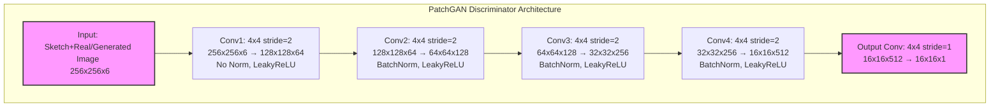

# Enhancing Forensic Sketch-to-Image GAN Performance with Advanced Image Preprocessing Techniques

Welcome to the project documentation for an innovative approach to sketch-to-image generation, which leverages advanced image preprocessing techniques to significantly improve the quality and accuracy of generated images. This system uses a pix2pix GAN architecture, trained on the CUHK dataset, and incorporates gamma-inverted sketches to produce photorealistic images. The enhancements not only lead to higher Structural Similarity Index (SSIM) and Peak Signal-to-Noise Ratio (PSNR) but also enhance the accuracy of a subsequent classifier trained to identify individuals from these images. We explore two distinct training setups: one using standard sketches and another using gamma-inverted sketches, demonstrating the substantial benefits of image preprocessing in deep learning applications for criminal identification.

## Project Overview

This project introduces a dual-phase training approach where Generative Adversarial Networks (GANs) are first trained with standard sketches and then re-trained with gamma-inverted sketches. The comparative analysis of these two training phases clearly shows that preprocessing sketches with techniques such as gamma inversion significantly enhances the visual quality of generated images as reflected by improved SSIM and PSNR metrics. 

<!-- Additionally, a classifier utilized these generated images to identify individuals, achieving higher accuracy with images derived from enhanced sketches. This documentation details the methods used, the GAN training process, enhancements applied, and the comparative results of our experiments. -->

## Model Architectures

### U-Net Generator Architecture

```mermaid
graph TD
    subgraph "U-Net Generator Architecture"
        input[Input Sketch 256x256x3] --> down1
        
        subgraph "Encoder Path"
            down1[Down1: Conv 4x4 stride=2 <br/> 256x256x3 → 128x128x64] --> down2
            down2[Down2: Conv 4x4 stride=2 <br/> 128x128x64 → 64x64x128] --> down3
            down3[Down3: Conv 4x4 stride=2 <br/> 64x64x128 → 32x32x256] --> down4
            down4[Down4: Conv 4x4 stride=2 <br/> 32x32x256 → 16x16x512] --> down5
            down5[Down5: Conv 4x4 stride=2 <br/> 16x16x512 → 8x8x512] --> down6
            down6[Down6: Conv 4x4 stride=2 <br/> 8x8x512 → 4x4x512] --> down7
            down7[Down7: Conv 4x4 stride=2 <br/> 4x4x512 → 2x2x512]
        end

        subgraph "Decoder Path"
            down7 --> up1[Up1: TransConv 4x4 stride=2 <br/> 2x2x512 → 4x4x512]
            up1 & down6 --> up2[Up2: TransConv 4x4 stride=2 <br/> 4x4x1024 → 8x8x512]
            up2 & down5 --> up3[Up3: TransConv 4x4 stride=2 <br/> 8x8x1024 → 16x16x512]
            up3 & down4 --> up4[Up4: TransConv 4x4 stride=2 <br/> 16x16x1024 → 32x32x256]
            up4 & down3 --> up5[Up5: TransConv 4x4 stride=2 <br/> 32x32x512 → 64x64x128]
            up5 & down2 --> up6[Up6: TransConv 4x4 stride=2 <br/> 64x64x256 → 128x128x64]
            up6 & down1 --> final[Final: TransConv 4x4 stride=2 <br/> 128x128x128 → 256x256x3]
        end
        
        final --> output[Output Image 256x256x3]
    end

    style input fill:#f9f,stroke:#333,stroke-width:2px
    style output fill:#f9f,stroke:#333,stroke-width:2px
```

### PatchGAN Discriminator Architecture

The architectures above illustrate:

1. **U-Net Generator**:
* Encoder path with progressive feature compression
* Decoder path with progressive feature expansion
* Skip connections between corresponding encoder and decoder layers 
* Input/output dimensions and feature channels at each level

2. **PatchGAN Discriminator**:
* Five convolutional layers with progressive downsampling
* Batch normalization and LeakyReLU activation
* Patch-based output for local feature discrimination
* Complete dimension transformations at each layer

## GAN Training Process for Sketch-to-Image Generation

### Overview
This section outlines the training process for a Generative Adversarial Network (GAN) specifically designed to convert sketches to photorealistic images. The process involves two main components: the generator and the discriminator, each with distinct roles in the training dynamics.

### Model Components

### Generator (UNetGenerator)
- **Purpose**: Generates images from input sketches that are intended to mimic the style and content of real images.

### Discriminator (PatchGANDiscriminator)
- **Purpose**: Assesses the authenticity of image pairs, distinguishing between real images paired with their corresponding sketches and fake images generated by the generator.

### Loss Functions

- **Adversarial Loss (BCEWithLogitsLoss)**: Evaluates the discriminator's ability to classify real and fake image pairs, and guides the generator to produce images that can fool the discriminator.
  
- **Pixel-wise L1 Loss**: Measures the pixel-wise difference between generated images and real images, ensuring that the generator accurately replicates the details of the target images.

### Training Procedure

### Optimization Setup
Separate Adam optimizers are used for each model:
- **Generator's Optimizer**: Aims to minimize the combined adversarial and L1 losses.
- **Discriminator's Optimizer**: Focuses on minimizing the adversarial loss from discriminating between real and fake images.

#### Training Loop Dynamics
Each training epoch involves:
- **Discriminator Training**: 
  - Processes real and fake image pairs.
  - Aims to recognize real images as real and fake images as fake.
  - Backpropagates the loss to improve discrimination accuracy.

- **Generator Training**:
  - Generates images aimed at deceiving the discriminator.
  - Combines adversarial and L1 losses to improve both the realism and accuracy of generated images.
  - Backpropagates the combined loss to refine image generation capabilities.

#### Validation and Early Stopping
- **Validation Checks**: Regularly evaluate the generator's performance using the L1 loss on a validation set to monitor image accuracy.
- **Early Stopping**: Stops training if validation loss does not improve for a defined number of epochs, preventing overfitting.

The training strategy ensures that the generator produces high-quality images that are both visually convincing and highly accurate in terms of pixel resemblance to real images. This dual-focus approach is crucial for achieving realistic and practical results in sketch-to-image generation tasks.

### Grid Search Hyperparameter Tuning

The objective of the Grid Search Hyperparameter Tuning in this project was to systematically explore various combinations of learning rates, batch sizes, dropout rates, and L1 weights to identify the optimal settings for our Generative Adversarial Network (GAN) used in sketch-to-image generation. The goal was to maximize the quality of the generated images, as quantitatively measured by the Structural Similarity Index (SSIM) and Peak Signal-to-Noise Ratio (PSNR).

#### Hyperparameter Space
The hyperparameters varied during the grid search included:
- **Learning Rates**: [0.0002, 0.0005, 0.001, 0.005]
- **Batch Sizes**: [8, 16, 32, 64]
- **Dropout Rates**: [0.1, 0.3, 0.5]
- **L1 Weights** (not directly shown in tuning but implied in evaluations): [10, 50, 100, 200]

#### Methodology
Each combination of hyperparameters was used to train the model from scratch, ensuring that each configuration was evaluated independently. This approach allowed us to observe the impact of each hyperparameter on the model's ability to generate high-quality images.

- **Training Setup**: Each model was trained using a consistent dataset, ensuring that the only variables were the hyperparameters.
- **Evaluation**: After training, models were evaluated on a dedicated test set that the model had never seen during the training process. This helped in accurately assessing the generalizability of the model under each hyperparameter setting.

#### Evaluation Metrics
- **SSIM (Structural Similarity Index)**: Measures the similarity between two images. Higher SSIM values indicate better image quality and more accurate reproduction of the original image's structures.
- **PSNR (Peak Signal-to-Noise Ratio)**: Assesses the quality of a reconstructed image compared to its original version. Higher PSNR values indicate better image quality by showing higher signal-to-noise ratio.

#### Results
The results of the grid search were meticulously recorded, noting the SSIM and PSNR scores for each configuration. Below are the top-performing models based on both SSIM and PSNR, providing insights into which settings yielded the best overall image quality.

#### Grid Search Results for Original Models

##### Summary of Top Performing Models
This table presents the top 5 models that achieved the best overall performance, balancing both SSIM and PSNR metrics. These configurations demonstrated excellent performance in generating high-quality images while maintaining structural similarity to the target images.

| Model ID | Learning Rate | Batch Size | L1 Weight | Dropout Rate | SSIM  | PSNR  | Overview                                      |
|----------|---------------|------------|-----------|--------------|-------|-------|----------------------------------------------|
| 1        | 0.005         | 8          | 100       | 0.1          | 0.6858| 18.06 | Best overall, excellent balance and reduction|
| 2        | 0.001         | 8          | 10        | 0.5          | 0.6259| 18.40 | Strong in both metrics, high image quality   |
| 3        | 0.005         | 8          | 10        | 0.5          | 0.6549| 17.11 | Good image similarity with reasonable noise  |
| 4        | 0.001         | 8          | 100       | 0.1          | 0.6055| 18.00 | Well-balanced, effective in fidelity & noise |
| 5        | 0.005         | 8          | 50        | 0.1          | 0.6569| 17.25 | Strong performance, good overall quality     |

##### Models Optimized for Structural Similarity (SSIM)
The following table shows the top 5 models ranked by SSIM scores. These configurations particularly excel at maintaining structural similarity between generated and target images, which is crucial for preserving important facial features and details.

| Rank | Learning Rate | Batch Size | L1 Weight | Dropout Rate | SSIM  | PSNR  |
|------|---------------|------------|-----------|--------------|-------|-------|
| 1    | 0.005         | 8          | 200       | 0.3          | 0.7025| 17.85 |
| 2    | 0.005         | 8          | 100       | 0.1          | 0.6858| 18.06 |
| 3    | 0.005         | 8          | 10        | 0.5          | 0.6549| 17.11 |
| 4    | 0.005         | 8          | 50        | 0.3          | 0.6642| 17.56 |
| 5    | 0.005         | 8          | 10        | 0.1          | 0.6569| 17.25 |

##### Models Optimized for Image Quality (PSNR)
This table presents the top 5 models ranked by PSNR scores. These configurations achieve the best signal-to-noise ratio, resulting in cleaner and more visually appealing generated images.

| Rank | Learning Rate | Batch Size | L1 Weight | Dropout Rate | SSIM  | PSNR  |
|------|---------------|------------|-----------|--------------|-------|-------|
| 1    | 0.001         | 8          | 10        | 0.5          | 0.6259| 18.40 |
| 2    | 0.005         | 8          | 100       | 0.1          | 0.6858| 18.06 |
| 3    | 0.001         | 8          | 100       | 0.1          | 0.6055| 18.00 |
| 4    | 0.0002        | 16         | 10        | 0.5          | 0.6031| 18.01 |
| 5    | 0.0005        | 8          | 10        | 0.3          | 0.5591| 18.24 |

### Preprocessing for Enhanced Sketches

#### Objective
The objective of applying gamma inversion and other preprocessing techniques is to determine whether these enhancements result in higher quality image generation by a GAN. This involves transforming sketches in a way that enhances their features, making them more suitable for training the GAN to produce photorealistic images.

#### Gamma Inversion Sketch Enhancement Process

The preprocessing of images into gamma-inverted sketches involves a series of steps designed to enhance the details and contrasts within the sketches. Here's a detailed breakdown of each step:

1. **Image Loading**
   - The original image is loaded using OpenCV, ensuring it is in a format suitable for image processing.

2. **Grayscale Conversion**
   - The image is converted from RGB to grayscale. This reduction of complexity by eliminating color information focuses attention on the intensity of pixels, crucial for highlighting structural details in the sketch.

3. **Gaussian Blur Application**
   - A Gaussian blur is applied to the grayscale image. This smoothing step reduces noise and detail, which is vital for the subsequent edge enhancement.

4. **Edge Enhancement**
   - By dividing the grayscale image by its blurred version and scaling the result, edges are significantly enhanced. This step emphasizes the contrast between sharply defined edges and smoothed areas, highlighting boundaries and textures essential for sketches.

5. **Gamma Correction with Inversion**
   - Applying gamma correction with inversion (e.g., using a gamma value of 0.1) inverts the light-dark dynamics. This enhances contrast, particularly around edges and textures, making these features more pronounced and easier for the GAN to learn.

6. **Saving the Sketch**
   - The enhanced sketch is saved and used as training data. These sketches are not only clearer for training but also provide a robust test of the GAN’s ability to replicate detailed textures and contrasts.

#### Rationale Behind Gamma Inversion

Using gamma inversion aims to:
- **Enhance Feature Learning**: By increasing contrast and edge clarity, the GAN focuses on critical structural elements, crucial for generating realistic outputs.
- **Improve Texture Reproduction**: The emphasized textures aid in creating more visually appealing and realistic generated images.
- **Adapt to Diverse Lighting Conditions**: Adjusting gamma values helps the model handle images under various lighting conditions, enhancing its robustness.

These preprocessing enhancements, especially gamma inversion, are designed to optimize the input sketches for GAN training. The goal is to check if these improved inputs lead to better-quality outputs in terms of image realism and fidelity, crucial for applications like criminal identification where detail accuracy is paramount.

#### Impact on GAN Training
The use of gamma-inverted sketches is expected to provide the GAN with clearer and more detailed information about the edges and contours present in the original images, which can be crucial for improving the accuracy of the image generation process.

### Grid Search Hyperparameter Tuning for Enhanced Models

After applying gamma inversion to the sketches, the models were retrained using a grid search approach to find the optimal hyperparameters that yield the best results in terms of image quality, assessed by SSIM and PSNR.

#### Hyperparameter Grid
- **Learning Rates**: [0.0002, 0.0005, 0.001, 0.005]
- **Batch Sizes**: [8, 16]
- **Dropout Rates**: [0.1, 0.3, 0.5]

#### Evaluation Metrics
- **SSIM (Structural Similarity Index)**: Measures the quality of the generated images in terms of their structural similarity to the target images.
- **PSNR (Peak Signal-to-Noise Ratio)**: Evaluates the quality of the generated images by comparing the noise level to the fidelity of the image reproduction.

#### Grid Search Results for Gamma-Inverted Models

##### Summary of Enhanced Model Performance
The following table presents the top performing models after applying gamma inversion preprocessing. These results show significant improvements in both SSIM and PSNR metrics compared to the baseline models.

| Model ID | Learning Rate | Batch Size | Dropout Rate | SSIM  | PSNR  | Overview                                       |
|----------|---------------|------------|--------------|-------|-------|------------------------------------------------|
| 1        | 0.005         | 16         | 0.1          | 0.8076| 22.475| Highest SSIM, best overall PSNR, excellent balance|
| 2        | 0.005         | 8          | 0.5          | 0.7704| 22.268| Strong in both metrics, good fidelity           |
| 3        | 0.001         | 8          | 0.1          | 0.7814| 22.833| High SSIM and PSNR, best learning rate 0.001   |
| 4        | 0.0005        | 8          | 0.1          | 0.7738| 22.808| Well-balanced, effective in fidelity and noise  |
| 5        | 0.0002        | 8          | 0.3          | 0.7703| 23.015| Strong performance, best PSNR overall          |

##### Enhanced Models Optimized for Structural Similarity (SSIM)
These configurations achieved the highest SSIM scores after gamma inversion, demonstrating superior preservation of structural details and features.

| Rank | Learning Rate | Batch Size | Dropout Rate | SSIM  | PSNR  |
|------|---------------|------------|--------------|-------|-------|
| 1    | 0.005         | 16         | 0.1          | 0.8076| 22.475|
| 2    | 0.001         | 8          | 0.1          | 0.7814| 22.833|
| 3    | 0.0005        | 8          | 0.1          | 0.7738| 22.808|
| 4    | 0.005         | 8          | 0.5          | 0.7704| 22.268|
| 5    | 0.0002        | 8          | 0.3          | 0.7703| 23.015|

##### Enhanced Models Optimized for Image Quality (PSNR)
These models achieved the highest PSNR scores after gamma inversion, indicating superior noise reduction and overall image quality.

| Rank | Learning Rate | Batch Size | Dropout Rate | SSIM  | PSNR  |
|------|---------------|------------|--------------|-------|-------|
| 1    | 0.0002        | 8          | 0.3          | 0.7703| 23.015|
| 2    | 0.001         | 8          | 0.1          | 0.7814| 22.833|
| 3    | 0.0005        | 8          | 0.1          | 0.7738| 22.808|
| 4    | 0.005         | 16         | 0.1          | 0.8076| 22.475|
| 5    | 0.005         | 8          | 0.5          | 0.7704| 22.268|

#### Conclusion
The results indicate a significant improvement in both SSIM and PSNR scores with the use of enhanced sketches. This suggests that preprocessing sketches with gamma inversion can be a beneficial technique in preparing training data for GANs, leading to higher quality and more realistic image generation.

# Model Download Instructions

Due to the large size of the trained model files, they are hosted externally on Google Drive. Below you will find the links to download each of the model files. Each model corresponds to a specific set of hyperparameters tested during our experiments.

## Available Models

Here is a list of the available models along with their corresponding hyperparameters and Google Drive download links:

1. **Model with lr=0.005, batch_size=8, l1_weight=100, dropout_rate=0.1**
   - **Description**: This model achieved the highest performance in our tests, showing excellent balance between similarity and noise reduction.
   - **Google Drive Link**: [Download Model](https://drive.google.com/drive/folders/1INPnHaby9jZZUpLsL0K1skMNQ0YX5jbE?usp=drive_link)
   
2. **Model with lr=0.001, batch_size=8, l1_weight=10, dropout_rate=0.5**
   - **Description**: Strong in both SSIM and PSNR metrics, excellent for maintaining high image quality.
   - **Google Drive Link**: [Download Model](https://drive.google.com/drive/folders/1-0lGv7r1zxtROls2EO8GgpKuT0ckxbaa?usp=drive_link)

3. **Model with lr=0.005, batch_size=8, l1_weight=10, dropout_rate=0.5**
   - **Description**: High SSIM score and decent PSNR, indicating good image similarity with reasonable noise reduction.
   - **Google Drive Link**: [Download Model](https://drive.google.com/drive/folders/1ZpMIGWklQqDT6neDr9jRiwI_8xhCe7Zw?usp=drive_link)

### How to Use the Models

After downloading the models, please follow these steps to use them in your projects:

1. **Download the Model**: Click on the link provided above and download the model file to your local machine.
2. **Place the Model in Your Project Directory**: Move the downloaded `.pth` file into the designated model directory in your project structure.
3. **Update Model Path in Code**: Ensure your code references the correct path where the model file is stored.
4. **Load and Use the Model**: Use the standard PyTorch method to load the model weights and evaluate or further fine-tune the model on your data.

### Troubleshooting

If you encounter any issues while downloading or using the models, please check the following:

- Ensure you have sufficient permissions to access the Google Drive links.
- Verify that the downloaded files are complete and not corrupted.
- Check that your environment meets all the dependencies required to run the model.

For more support, feel free to open an issue in this repository or contact lnu.prat@northeastern.edu.

